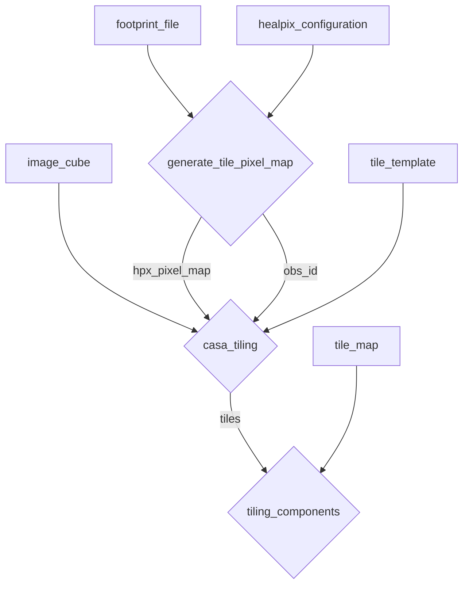

# HPX Tiles

Scripts required for performing HEALPIX tiling of spectral line cubes.

Diagram below summarises the tiling workflow.



## Generate tile pixel map

For every observation provide the footprint file from the POSSUM evaluation files. Recommended default configuration

```
{
  "nside": 32,
  "tile_naxis": 2048,
  "tile_cdelt": 0.0009710633897,
  "beam_radius": 1.2,
  "beam_sample_points": 16,
  "number_of_beams": 36
}
```

## CASA tiling

Run the tiling with CASA on the image cubes.

Assumed `naxis = 2048` unless otherwise provided as an argument. Should get this from the healpix configuration used to generate tile pixel maps.
