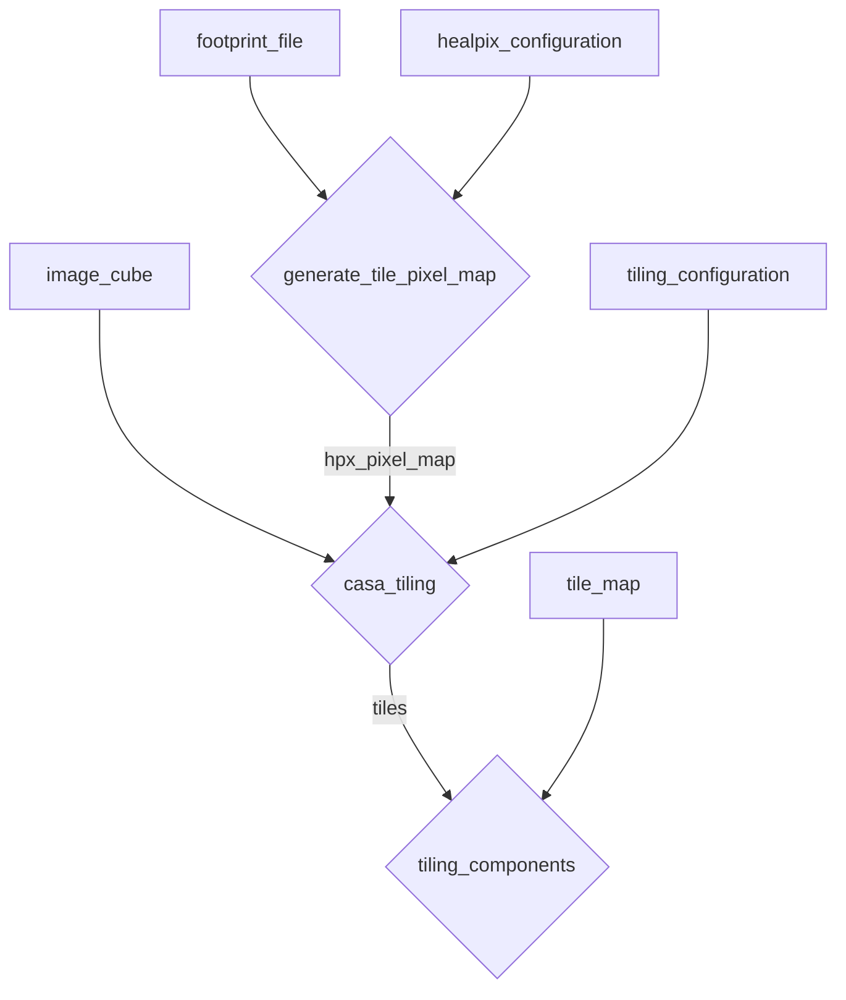

# HPX Tiles

Scripts required for performing HEALPIX tiling of spectral line cubes.

Diagram below summarises the tiling workflow.

```mermaid
    graph TD;
    footprint_file-->A{generate_tile_pixel_map};
    healpix_configuration-->A{generate_tile_pixel_map};
    image_cube-->B{casa_tiling};
    A{generate_tile_pixel_map}-- hpx_pixel_map -->B{casa_tiling};
    tiling_configuration-->B{casa_tiling};
    B{casa_tiling}-- tiles -->C{tiling_components};
    tile_map-->C{tiling_components}
```